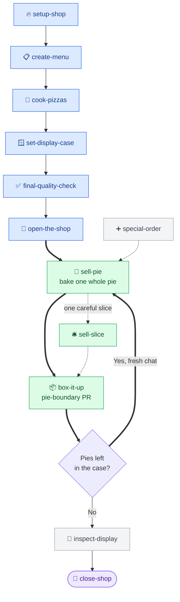

<!-- README.md -->
<!-- ByTheSlice — npm + GitHub README. Pizza-themed, two-tier: simple-at-top + technical-below. -->

<div align="center">

# 🍕 ByTheSlice

**A grab-and-go pizza shop for shipping software.**

*Plan today's menu. Prep the line. Bake one pie at a time, slide it onto the display tray, and keep service moving until the board is clear.*

[](https://www.npmjs.com/package/bytheslice)
[](LICENSE)
[](https://nodejs.org)
[](https://www.anthropic.com/claude-code)
[](https://cursor.com)
[](https://github.com/steve-piece/bytheslice/stargazers)

</div>

---

ByTheSlice runs your project like a **pizza shop**. You don't build a whole app in one prompt — you prep the kitchen, then sell slices to customers one at a time, with quality checks every step of the way. No 200-file PRs nobody reads. No "what does this even do" three months later.

**Three steps. Thirteen commands. The kitchen does the rest.**

---

## Table of Contents

**Start here**
- [How it works — in three steps](#how-it-works--in-three-steps)
- [Quick Start](#quick-start)
- [Install](#install)

**Under the hood** *(for developers + power agentic-coding users)*
- [The Kitchen — workflow diagram](#the-kitchen--workflow-diagram)
- [The master checklist — Prep + Pies](#the-master-checklist--prep--pies)
- [Personalize — `bytheslice.config.json`](#personalize--bythesliceconfigjson)
- [Architecture & conventions](#architecture--conventions)
- [Experimental skills](#experimental-skills)
- [FAQ](#faq)
- [Contributing](#contributing) · [Repository](#repository) · [License](#license)

---

# Start here

## How it works — in three steps

Think of your project as a pizza shop. There are three things you do, in order. Every command name links to its full reference (`SKILL.md`).

### 🔥 Step 1 — Open the shop *(one-time prep)*

Six things, in order, once per project:

| Command | In pizza terms | What it does |
|---|---|---|
| [`/setup-shop`](skills/setup-shop/SKILL.md) | Unlock the doors, fire up the oven. | Bootstraps a new project or drops ByTheSlice into an existing one. |
| [`/create-menu`](skills/create-menu/SKILL.md) | Decide which pies to serve. | Turns a free-form brief into a structured PRD. |
| [`/cook-pizzas`](skills/cook-pizzas/SKILL.md) | Pre-bake every pie on the menu. | Decomposes the PRD into Pies (3–8 slices each) + a nested master checklist. |
| [`/set-display-case`](skills/set-display-case/SKILL.md) | Build the case the pies sit in. | Generates the design system — tokens, components, the `/library` preview route. |
| [`/final-quality-check`](skills/final-quality-check/SKILL.md) | Install the quality line. | Wires CI/CD, E2E tests, design-system compliance, visual regression. |
| [`/open-the-shop`](skills/open-the-shop/SKILL.md) | Flip the OPEN sign, stock ingredients. | Sets up env vars + external service credentials. The most hands-on prep step. |

### 🛎️ Step 2 — Serve customers *(the everyday loop)*

Where you'll spend most of your time. **`/sell-pie`** is the forefront motion — bake a whole Pie autonomously, then box it at the boundary. Reach for **`/sell-slice`** when one slice needs a careful, hands-on touch.

| Command | In pizza terms | What it does |
|---|---|---|
| [`/sell-pie`](skills/sell-pie/SKILL.md) | Bake a whole pie, then set the tray on the counter. | **The primary everyday command.** Autonomous baker over one Pie: per-slice build → test → verify → fix, commit + push each slice (no PR), then opens the boundary PR via `/box-it-up`. |
| [`/sell-slice`](skills/sell-slice/SKILL.md) | Run one slice through the kitchen line by hand. | High-touch single-slice delivery with the library preview gate intact. For sensitive or collaborative work. |
| [`/box-it-up`](skills/box-it-up/SKILL.md) | Box the pie, ring it up, hand it over. | Opens the `Pie N` PR, watches CI, auto-fixes on red, merges on your approval (never squash), syncs main, cleans up. `--slice` is the per-slice commit+push `/sell-pie` calls. |

A Pie is the unit of autonomy, PR, and context-refresh. **After each Pie merges, start a fresh chat and bake the next one** — until the master checklist is empty.

### ✨ Step 3 — Handle the unusual *(side flows)*

On-demand, no particular order:

| Command | In pizza terms | What it does |
|---|---|---|
| [`/special-order`](skills/special-order/SKILL.md) | Cook something off-menu on the spot. | Bolts new features onto an in-progress project — writes fresh stage files, hands off to `/sell-slice`. |
| [`/inspect-display`](skills/inspect-display/SKILL.md) | Eyeball every pie on the tray. | Read-only audit of the running app — every route, every page, captured to a report. |
| [`/run-the-day`](skills/run-the-day/SKILL.md) ⚠️ | Auto-pilot the whole day's service. | Thin chainer that drives `/sell-pie` across every Pie in sequence. *Experimental — fine for short roadmaps, drifts across many pies.* |
| [`/close-shop`](skills/close-shop/SKILL.md) ⚠️ | Sit down and debrief after service. | Friction retro on the workflow itself — drafts plugin improvements back to disk. *Experimental.* |

> [!IMPORTANT]
> **Shop rules** the plugin enforces, no exceptions:
> 1. **Every slice passes the quality line** (lint, type, build + UI test review). A bad pie doesn't go on the display.
> 2. **Selling and boxing are decoupled.** Slices commit + push to the pie branch with no PR or CI; `/box-it-up` opens the single `Pie N` PR and merges at the **pie boundary** — so CI fires once per pie, and you can taste-test between slices.
> 3. **Every skill is independently invocable.** Drop `/set-display-case` onto any project to bolt on a design system, or `/box-it-up` onto any branch to push it. The full workflow is opt-in.

---

## Quick Start

```bash
# 1. Install (one-time)
npx bytheslice install --target both

# 2. Open the shop (one-time per project)
/bytheslice:setup-shop
/bytheslice:create-menu
/bytheslice:cook-pizzas
/bytheslice:set-display-case
/bytheslice:final-quality-check
/bytheslice:open-the-shop

# 3. Serve customers (repeat, fresh chat per pie)
/bytheslice:sell-pie          # bakes a whole Pie autonomously, opens the boundary PR
# — or, for one careful slice at a time:
/bytheslice:sell-slice
/bytheslice:box-it-up
```

Repeat step 3 until the master checklist is empty. That's the whole motion.

> [!NOTE]
> Every command also works without the `/bytheslice:` prefix in Claude Code if no other plugin claims it (e.g. just `/sell-slice`). Old v3 names (`/deliver-stage`, `/ship-pr`, etc.) still work for one release as backward-compat aliases.

---

## Install

| Option | Command | When to use |
|---|---|---|
| **Claude Code plugin** *(recommended)* | `/add-plugin bytheslice` | Normal interactive use. |
| **npm CLI** | `npx bytheslice install --target both` | Automation, CI bootstraps, devcontainers. Scriptable + idempotent. |
| **From GitHub** | `npx github:steve-piece/bytheslice install --target both` | No npm install. |
| **Pick & choose skills** | `npx bytheslice install --mode skills --skill setup-shop --skill sell-slice` | Grab individual skills into `./.bytheslice-installs/skills/`. |

Default install paths — **Cursor:** `~/.cursor/plugins/local/bytheslice` · **Claude Code:** `~/.claude/plugins/bytheslice`. Scope a single host with `--target cursor` / `--target claude`; override paths with `--cursor-dir` / `--claude-dir` / `--skills-dir`. For declarative installs, point `--config <path>` at a JSONC file (see [`skills-config.example.json`](scripts/install/skills-config.example.json)).

---

# Under the hood

*Everything below is for developers and power agentic-coding users. If you just want to ship features, you can stop at Quick Start.*

## The Kitchen — workflow diagram



🔵 **Prep** *(once per project)* · 🟢 **Service** *(the daily loop)* · ⚪ **Side flows** *(on demand)* · 🟣 **Wrap-up**. Thick arrows are the everyday path; dotted arrows are optional branches.

**Finish a pie, start a fresh chat, bake the next** — until the master checklist is green.

---

## The master checklist — Prep + Pies

`cook-pizzas` produces `docs/plans/00_master_checklist.md` as a **two-level Pie / Slice roadmap** — **Pie 1 — Foundations** (tracked via the `## Prep` gate) then the feature Pies (2+):

```markdown
## Prep — Pie 1: Foundations (run once before any feature work)

[ ] Display case built       — run /bytheslice:set-display-case
[ ] Quality line installed   — run /bytheslice:final-quality-check
[ ] Shop open                — run /bytheslice:open-the-shop
[ ] DB schema foundation     — run /bytheslice:sell-slice on Slice 1.x (if backend)

## Pie 2 — Blog Editor    <!-- review: boundary -->

### Slice 2.6 — Build the Blog Editor frontend
[ ] step
[ ] step

### Slice 2.7 — Wire server actions into the editor
[ ] step
```

A **Pie** is a coherent chapter of 3–8 slices; a **Slice** is one vertical deliverable. `/sell-slice`'s prep gate **refuses to start feature work until every Pie-1 / Prep box is `[x]`**. For the full hierarchy, caps, and how legacy flat-v4 / v3 checklists are handled, see [**Architecture & conventions**](#architecture--conventions).

> [!NOTE]
> **Hard caps per slice:** 6 tasks, ~10–15 files changed, completable in one fresh agent session. Override `stages.maxTasksPerStage` in `bytheslice.config.json` if you really need a bigger slice — but the cap exists for a reason.

---

## Personalize — `bytheslice.config.json`

Drop a `bytheslice.config.json` at your project root to override defaults:

```jsonc
{
  "modelTiers":   { "implementer": "opus", "qualityReviewer": "opus",
                    "sliceTester": "sonnet", "sliceVerifier": "sonnet" },
  "stages":       { "maxTasksPerStage": 6, "targetFeatureStages": "20-30" },
  "verification": { "viewports": [375, 1280],
                    "e2e": { "feature": "always", "regressionCore": "critical-only", "visual": "off" } },
  "flow":         { "autoApproveBuildPlan": false, "libraryGate": "self-critique" },
  "review":       { "default": "boundary" },   // per-pie override via the `<!-- review: -->` annotation
  "mcps":         { "shadcn": true, "magic": false, "figma": false, "chromeDevTools": true },
  "visualReview": { "tools": ["claude-in-chrome", "chrome-devtools-mcp", "playwright"], "vizzly": false },
  "hitl":         { "additionalCategories": [] },
  "rules":        { "imports": [] },
  "runPipeline":  { "platformWalkEvery": 5, "haltOn": "broken" }
}
```

**Precedence (top wins):** `env vars` → `bytheslice.config.json` → `project rules file (CLAUDE.md / AGENTS.md)` → `plugin defaults`.

Full schema and precedence rules: [`bytheslice-config-schema.md`](skills/setup-shop/references/bytheslice-config-schema.md). System-wide defaults live at `~/.bytheslice/defaults.json` (created during first-time install). Config keys keep their v3 names for backward compatibility; as of v5 the `ciCdGuardrails` / `basicChecksRunner` / `aggregatingTestReviewer` tiers are deprecated aliases of `sliceVerifier` and still resolve.

---

## Architecture & conventions

The kitchen runs on a handful of non-negotiable rules — per-slice **verify-once**, **context-separated** dispatch, **preview-first** library delivery, **deterministic hook** enforcement. The full reference lives in **[docs/architecture.md](docs/architecture.md)**:

- [**Pies & Slices**](docs/architecture.md#pies--slices--the-two-level-checklist) — the two-level checklist, caps, the Prep gate
- [**Mode detection**](docs/architecture.md#mode-detection--standalone-vs-sequential) — standalone vs sequential, per-skill posture table
- [**The verify-once model**](docs/architecture.md#the-verify-once-model) — tester + verifier, build manifest, context separation, type-routed testing
- [**Delivery & git**](docs/architecture.md#delivery--git--selling-vs-boxing) — selling vs boxing, one pie per PR, worktrees
- [**Design-system delivery**](docs/architecture.md#design-system-delivery) — preview-first library gate, visual review tooling
- [**Orchestration principles**](docs/architecture.md#orchestration-principles) — subagent-driven, exit-criteria contract, HITL bubbling, model tiers
- [**Hook enforcement**](docs/architecture.md#hook-enforcement) — what the [`hooks/`](hooks/) layer blocks at the tool level
- [**Legacy & migration**](docs/architecture.md#legacy--migration) — flat v4 / v3 projects, `--repie`

---

## Experimental skills

> [!WARNING]
> Not currently reliable in Claude Code or Cursor — agent attention drifts on long-running multi-stage tasks. Curious how they hold up in systems with stronger long-horizon multi-agent orchestration.

`/sell-pie` (one Pie per run, stopping at the boundary) is the autonomous surface and is **not** experimental. The experimental part is unattended *whole-roadmap* automation:

- **`/run-the-day`** — thin chainer that drives `/sell-pie` across **every** Pie until the checklist is green.
- **`/close-shop`** — after-service retrospective that drafts plugin improvements back to disk.

Running in **Cursor or any host without `/loop`, `Workflow`, or `/goal`?** The skills don't silently drop the logic — they fall back to in-context self-pacing with manual schema validation. See the [Cursor / non-Claude-Code fallback](docs/architecture.md#cursor--non-claude-code-fallback) section.

---

## FAQ

<details>
<summary><b>Do I need both Claude Code and Cursor?</b></summary>

No. ByTheSlice works in either host on its own. `--target both` is just a convenience for people who jump between IDEs.

</details>

<details>
<summary><b>What's the smallest possible slice?</b></summary>

A slice has to be a real *user-facing* delta — UI + route + data + tests for one thing. The hard floor is roughly "one button that actually does something end-to-end." If you can't draw a user-visible bite out of it, it belongs as part of a foundation prep step instead.

</details>

<details>
<summary><b>Can I skip the verification gates?</b></summary>

Technically yes (the orchestrator will accept a HITL override with `destructive_operation` category), but every story we've seen of "I'll just skip the gates this once" ends with a slice that breaks main. The whole point is that the kitchen doesn't ship slices it didn't taste.

</details>

<details>
<summary><b>What happens if a slice is too big?</b></summary>

`/sell-slice` will stop at the 6-task / ~15-file cap and return `needs_human: true` with category `prd_ambiguity` asking you to split the stage. Then re-run `/cook-pizzas` against the same PRD with that stage flagged for further decomposition (or use `/special-order` to add a refined split).

</details>

<details>
<summary><b>Does this work with non-Next.js stacks?</b></summary>

Yes. As of v4.2, `/setup-shop` bootstraps **Next.js (App Router or Pages), Vite + React, SvelteKit, and Astro** directly, plus a plain **Node API** flow with no frontend. The canonical support matrix lives in [`framework-detect.md`](skills/setup-shop/references/framework-detect.md).

Next.js App Router is the most-validated path end-to-end. The other frontends bootstrap and get a full design system + CI/CD scaffold, but the Phase 4.5 library-preview templates currently assume App Router conventions — non-Next stacks bubble a one-time HITL at that gate until per-framework templates land. The verification gates and skill orchestration are stack-agnostic regardless. Remix and Nuxt are not yet detected; they bubble HITL and stop.

</details>

<details>
<summary><b>I just want to add a design system / CI/CD / env-setup to my existing app. Do I have to do the full workflow?</b></summary>

No. Every foundation skill is standalone-invocable. Drop into any project and run just `/bytheslice:set-display-case` (or `/final-quality-check`, or `/open-the-shop`). They auto-detect that there's no master checklist and run end-to-end without trying to coordinate with one.

</details>

<details>
<summary><b>How do I uninstall?</b></summary>

```bash
rm -rf ~/.cursor/plugins/local/bytheslice ~/.claude/plugins/bytheslice
```

That's it. The plugin doesn't write anywhere else outside your project's `bytheslice.config.json`.

</details>

---

## Contributing

Contributions are welcome — especially if you've got real-world friction reports from running long plans.

```bash
# 1. Fork + clone, then install your fork locally for live testing
git clone https://github.com/<your-username>/bytheslice.git
cd bytheslice
node ./bin/bytheslice.js install --target both

# 2. Make your slice on a branch, then push and open a PR
git checkout -b feat/<scope>
git commit -m "feat: <what changed>"
git push -u origin HEAD
```

The plugin eats its own cooking — internal changes go through the same `/sell-slice` → `/box-it-up` motion. Run `/bytheslice:close-shop` after a release to surface friction and draft improvements back to the repo.

---

## Repository

- **GitHub:** [steve-piece/bytheslice](https://github.com/steve-piece/bytheslice)
- **npm:** [bytheslice](https://www.npmjs.com/package/bytheslice)
- **Changelog:** [CHANGELOG.md](CHANGELOG.md) · **Architecture:** [docs/architecture.md](docs/architecture.md) · **Issues:** [GitHub Issues](https://github.com/steve-piece/bytheslice/issues)

---

## License

[MIT](LICENSE) © Steven Light

<div align="center">

—

*Open the shop. Sell one slice at a time. Taste-test before it leaves the kitchen.*

🍕

</div>
