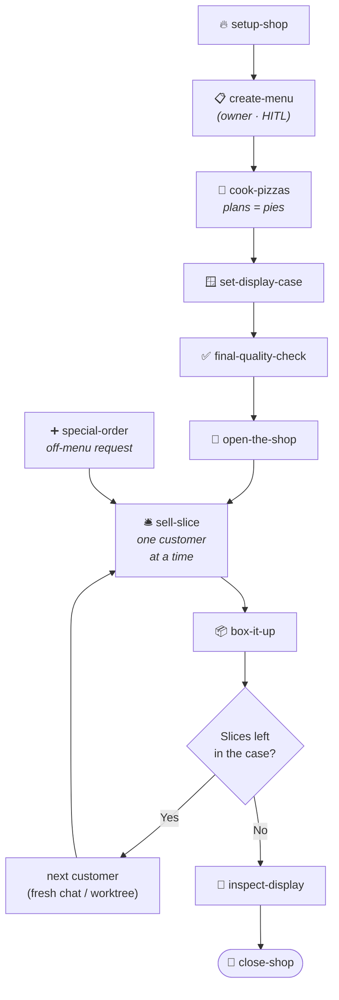

<!-- README.md -->
<!-- ByTheSlice — npm + GitHub README. Pizza-themed, two-tier: simple-at-top + technical-below. -->

<div align="center">

# 🍕 ByTheSlice

**A grab-and-go pizza shop for shipping software.**

*Plan today's menu. Prep the line. Bake one pie at a time, slide it onto the display tray, and keep service moving until the board is clear.*

[](https://www.npmjs.com/package/bytheslice)
[](LICENSE)
[](https://nodejs.org)
[](https://www.anthropic.com/claude-code)
[](https://cursor.com)
[](https://github.com/steve-piece/bytheslice/stargazers)

</div>

---

ByTheSlice runs your project like a **pizza shop**. You don't build a whole app in one prompt — you prep the kitchen, then sell slices to customers one at a time, with quality checks every step of the way. No 200-file PRs nobody reads. No "what does this even do" three months later.

---

## Table of Contents

**Start here**
- [How it works — in three steps](#how-it-works--in-three-steps)
- [Quick Start](#quick-start)
- [Install](#install)

**Under the hood** *(for developers + power agentic-coding users)*
- [The Menu — full skill reference](#the-menu--full-skill-reference)
- [The Kitchen — workflow diagram](#the-kitchen--workflow-diagram)
- [The master checklist — Prep + Stages](#the-master-checklist--prep--stages)
- [Mode detection — standalone vs sequential](#mode-detection--standalone-vs-sequential)
- [Personalize — `bytheslice.config.json`](#personalize--bythesliceconfigjson)
- [Conventions worth knowing](#conventions-worth-knowing)
- [Experimental skills](#experimental-skills)
- [FAQ](#faq)
- [Contributing](#contributing) · [Repository](#repository) · [License](#license)

---

# Start here

## How it works — in three steps

Think of your project as a pizza shop. There are three things you do, in order:

### 🔥 Step 1 — Open the shop *(one-time prep)*

Before you serve a single customer, six things need to happen. In order, once per project:

| Command | What it does, in pizza terms | What it really does |
|---|---|---|
| `/setup-shop` | Unlock the doors, fire up the oven, stock the line. | Bootstraps a new project or drops ByTheSlice into an existing one. |
| `/create-menu` | Decide which pies to serve today. | Turns a free-form brief into a structured PRD. |
| `/cook-pizzas` | Pre-bake every pie on today's menu. Each "cooked pie" is a plan file that tells the kitchen how to make that slice. | Decomposes the PRD into 20–30 vertical-slice stages + a master checklist. |
| `/set-display-case` | Build the display case the pies will sit in. | Generates the design system — tokens, components, the `/library` preview route. |
| `/final-quality-check` | Install the quality line every pie crosses on the way to the display. | Wires CI/CD, E2E tests, design-system-compliance, visual regression. |
| `/open-the-shop` | Flip the OPEN sign, unlock the cash drawer, stock ingredients. | Sets up env vars + external service credentials. Most operator-attention-heavy step. |

The shop is open. Step 1 done.

### 🛎️ Step 2 — Serve customers *(the everyday loop)*

This is what you'll spend most of your time doing. Two commands, run in pairs, **fresh chat per pair**.

| Command | What it does, in pizza terms | What it really does |
|---|---|---|
| `/sell-slice` | Pull one pie off the rack, run it through the kitchen line, slice and serve. | Reads the next stage from the checklist, builds the code, runs quality checks, commits locally. |
| `/box-it-up` | Box the slice, ring it up, hand it across the counter. | Pushes the branch, opens the PR, watches CI, gets your merge approval, cleans up. |

After each pair, start a fresh chat and do it again. Keep going until the master checklist is empty.

### ✨ Step 3 — Handle the unusual *(side flows)*

For when normal service isn't enough. Use these on-demand, not in any specific order:

| Command | What it does, in pizza terms | What it really does |
|---|---|---|
| `/special-order` | A regular walks in wanting something not on the menu. Cook it on the spot, add it to the tray. | Bolts new features onto an in-progress project — writes fresh stage files, hands off to `/sell-slice`. |
| `/inspect-display` | Walk past the tray and eyeball every pie. Anything wilted? Mock data? Cold spots? | Read-only audit of the running app — every route, every page, captured to a report. |
| `/run-the-day` ⚠️ | Auto-pilot mode. Open, run the whole day's service, close out. *(Experimental. Fine for short menus, drifts on long days.)* | Drives the whole master checklist autonomously. v4 adds `/goal`-driven session continuation in `--auto-*` modes. |
| `/close-shop` ⚠️ | After service, sit down and debrief. *(Experimental.)* | Friction retro on the workflow itself — drafts plugin improvements back to disk. |

That's the whole workflow. **Three steps. Twelve commands. The kitchen does the rest.**

> [!IMPORTANT]
> **Shop rules** the plugin enforces, no exceptions:
> 1. Every slice passes the quality line (lint, type, build + UI test review). A bad pie doesn't go on the display.
> 2. Selling and boxing are decoupled. `/sell-slice` stops at *"committed locally, ready for review"* so you can taste-test before handing over. Then `/box-it-up` handles push → CI → merge.
> 3. Every skill is **independently invocable**. Drop `/set-display-case` onto any project to bolt on a design system, or `/box-it-up` onto any branch to push it. The full workflow is opt-in.

---

## Quick Start

```bash
# 1. Install (one-time)
npx bytheslice install --target both

# 2. Open the shop (one-time per project)
/bytheslice:setup-shop
/bytheslice:create-menu
/bytheslice:cook-pizzas
/bytheslice:set-display-case
/bytheslice:final-quality-check
/bytheslice:open-the-shop

# 3. Serve customers (repeat, fresh chat per pair)
/bytheslice:sell-slice
/bytheslice:box-it-up
```

Repeat step 3 until the master checklist is empty. That's the whole motion.

> [!NOTE]
> Every command also works without the `/bytheslice:` prefix in Claude Code if no other plugin claims it (e.g. just `/sell-slice`). Old v3 names (`/deliver-stage`, `/ship-pr`, `/plan-phases`, etc.) still work for one release as backward-compat aliases.

---

## Install

### Option 1 — Claude Code plugin *(recommended)*

```text
/add-plugin bytheslice
```

### Option 2 — npm CLI *(scriptable, idempotent)*

For automation, CI bootstraps, or devcontainers:

```bash
npx bytheslice install --target both
```

Default install paths:

- **Cursor:** `~/.cursor/plugins/local/bytheslice`
- **Claude Code:** `~/.claude/plugins/bytheslice`

Use `--target cursor` or `--target claude` to scope a single host. Override paths with `--cursor-dir <path>` / `--claude-dir <path>`.

### Option 3 — Run straight from GitHub *(no npm install)*

```bash
npx github:steve-piece/bytheslice install --target both
```

### Option 4 — Pick & choose individual skills

```bash
npx bytheslice install --mode skills --skill setup-shop --skill sell-slice
```

Selected skills land in `./.bytheslice-installs/skills/`. Override the destination with `--skills-dir <path>`. For declarative installs, point `--config <path>` at a JSONC file (see [`scripts/install/skills-config.example.json`](scripts/install/skills-config.example.json)).

---

# Under the hood

*Everything below is for developers and power agentic-coding users. If you just want to ship features, you can stop at Quick Start.*

---

## The Menu — full skill reference

Each skill is invokable via slash command in Claude Code or Cursor. The full reference, sub-agent roster, completion checklist, and HITL gates for any skill live at [`skills/<name>/SKILL.md`](skills/). Every skill is **invocable independently** — drop one onto any project without needing the rest of the workflow.

### Daily prep *(run once per project)*

| Skill | Slash command | What it does |
|---|---|---|
| `setup-shop` | `/bytheslice:setup-shop` | Three-flow setup: (1) first-time install creates `~/.bytheslice/defaults.json`, (2) new project scaffolds a single-app (Next.js App Router, Vite + React, SvelteKit, or Astro) or a Turborepo monorepo — or a plain Node API with no frontend, (3) existing project drops a per-project `bytheslice.config.json`. Stack detection + per-framework paths live in [`framework-detect.md`](skills/setup-shop/references/framework-detect.md). |
| `create-menu` | `/bytheslice:create-menu` | Plan-mode question gate → architecture conditional → brief mapping → Section 0–7 PRD generation → `prd-reviewer` agent loop (cap 2 revisions). |
| `cook-pizzas` | `/bytheslice:cook-pizzas` | 12-question elicitation → stage identification (≥2 stages per PRD feature) → parallel stage-writer dispatch → `master-checklist-synthesizer` emits the Prep section + feature stages. Refuses to overwrite an existing checklist. |
| `set-display-case` | `/bytheslice:set-display-case` | Validates Claude Design bundle if present, otherwise expands brand brief. Outputs `globals.css`, Tailwind config, `design-system.md`, design-system rules in project rules file, `/library` preview route. Standalone or sequential — flips `[ ] Display case built` in sequential. |
| `final-quality-check` | `/bytheslice:final-quality-check` | Dispatches eight specialized agents: `scaffold-discovery`, `framework-detector`, `e2e-installer`, `workflow-writer`, `husky-installer`, `lint-config-writer`, `branch-protection-writer`, `local-gates-runner`. Standalone or sequential — flips `[ ] Quality line installed`. |
| `open-the-shop` | `/bytheslice:open-the-shop` | Scans `.env.example` files, matches detected services against `known-services-catalog.md`, generates a manual setup checklist, waits for user confirmation, then runs `env-verifier` to gate before any feature work. Standalone or sequential — flips `[ ] Shop open`. |

### Service *(run repeatedly, fresh chat per slice)*

| Skill | Slash command | What it does |
|---|---|---|
| `sell-slice` | `/bytheslice:sell-slice` | 9-phase orchestrator. Phase 0 Prep-section precondition (v4) → reconnaissance (parallel) → Build Plan + authorization → Phase 2.5 `/goal` set (lifted from Exit criteria) → stage-type routing (frontend pipeline / internal implementer / legacy sub-skill dispatch for v3 projects) → spec + quality review loop → basic checks → type-aware aggregating test review → CI/CD guardrails → stage closeout. Library Preview Gate (Phase 4.5) HARD STOPS on user-visible UI changes. Stops at *"committed locally, ready for review"*. |
| `box-it-up` | `/bytheslice:box-it-up` | Pre-flight safety checks (never ship from main, never force-push, branch-reuse detection) → push → reuse-or-create PR → `gh pr checks --watch` (capped at 30 min/attempt) → `ci-fix-attempter` auto-fix loop on red (capped at 3 attempts before HITL) → user-authorized merge gate → main sync (`--ff-only`) → local + remote branch deletion + worktree cleanup. Universal closeout — also safe on hand-rolled branches. |

### Side flows

| Skill | Slash command | What it does |
|---|---|---|
| `special-order` | `/bytheslice:special-order` | Auto-detects Path A (ByTheSlice project, append stages) / Path B (existing non-ByTheSlice app, redirect to `/setup-shop`) / Path C (no project, redirect to bootstrap). Complexity assessor → `phased-plan-writer` in incremental mode → Exit-criteria contract verification → checklist append on a `chore/add-stages-<lo>-<hi>` branch. |
| `inspect-display` | `/bytheslice:inspect-display` | Discovers routes, drives a live browser via Claude-in-Chrome (fallback to Chrome DevTools MCP / Playwright), captures screenshots + console, scores against design tokens. Returns a ranked report of broken routes, mock-data leaks, dynamic-route validation gaps, console errors. Read-only. |

### Experimental *(see [Experimental skills](#experimental-skills) below)*

| Skill | Slash command | What it does |
|---|---|---|
| `run-the-day` | `/bytheslice:run-the-day` | Autonomous multi-stage variant of `/sell-slice`. Phase 0.5 sets a session-scoped `/goal` in `--auto-mvp` / `--auto-all` modes. Per-stage gate checklist, platform-walk checkpoints. |
| `close-shop` | `/bytheslice:close-shop` | After-service retro. Scans recent stage executions for friction, drafts improvement PRs against the plugin repo. |

---

## The Kitchen — workflow diagram



`/sell-slice` is the daily surface. **Finish a slice, start a fresh chat, run it again** — until the master checklist is green.

---

## The master checklist — Prep + Stages

`cook-pizzas` produces `docs/plans/00_master_checklist.md` with **two sections**:

```markdown
## Prep — run once before any feature work

[ ] Display case built       — run /bytheslice:set-display-case
[ ] Quality line installed   — run /bytheslice:final-quality-check
[ ] Shop open                — run /bytheslice:open-the-shop
[ ] DB schema foundation     — run /bytheslice:sell-slice on stage 4 (if backend)

## Stages

## Stage 5 — <first feature stage>
...
```

`/sell-slice`'s Phase 0 **refuses to start any feature stage until every Prep box is `[x]`**. Each foundation skill flips its own checkbox when invoked in sequential mode. The DB schema row is conditional — emitted only if the PRD has a backend.

> [!NOTE]
> **Hard caps per stage:** 6 tasks, ~10–15 files changed, completable in one fresh agent session. Override `stages.maxTasksPerStage` in `bytheslice.config.json` if you really need a bigger slice — but the cap exists for a reason.

**Legacy v3 projects** (master checklist has `stage_1_*`/`stage_2_*`/`stage_3_*` plan files instead of a Prep section): `/sell-slice` keeps a documented legacy routing path that dispatches the foundation skills as sub-skills when it encounters those stage types. No migration required.

---

## Mode detection — standalone vs sequential

Every skill auto-detects at startup whether a master checklist exists at the project root and runs in one of two modes:

| Mode | Trigger | Behavior |
|---|---|---|
| **Standalone** | No `docs/plans/00_master_checklist.md` | Run end-to-end, produce the artifact, exit cleanly. No checklist coordination, no "next step" handoff. |
| **Sequential** | Master checklist present | On completion, flip the corresponding Prep / Stage row to `[x]` and surface the recommended next step. |

You can override auto-detection with explicit `--standalone` or `--sequential` flags. Per-skill posture:

| Skill | Standalone | Sequential |
|---|:---:|:---:|
| `setup-shop` | ✓ entry point | — |
| `create-menu` | ✓ writes a PRD artifact | — |
| `cook-pizzas` | ✓ produces the checklist | refuses if one exists |
| `set-display-case` | ✓ standalone-invocable | ✓ flips Prep box |
| `final-quality-check` | ✓ standalone-invocable | ✓ flips Prep box |
| `open-the-shop` | ✓ standalone-invocable | ✓ flips Prep box |
| `sell-slice` | — | ✓ requires checklist |
| `box-it-up` | ✓ works on any branch | ✓ flips stage status on merge if matched |
| `special-order` | — | ✓ extends checklist |
| `inspect-display` | ✓ read-only audit | ✓ same |
| `run-the-day` | — | ✓ drives whole checklist |
| `close-shop` | — | ✓ needs execution history |

**The single rule that holds it together:** skills never assume they're being called from somewhere else. Detect mode from disk state, behave correctly in both, document both modes in the SKILL.md.

---

## Personalize — `bytheslice.config.json`

Drop a `bytheslice.config.json` at your project root to override defaults:

```jsonc
{
  "modelTiers":   { "implementer": "opus", "qualityReviewer": "opus" },
  "stages":       { "maxTasksPerStage": 6, "targetFeatureStages": "20-30" },
  "mcps":         { "shadcn": true, "magic": false, "figma": false, "chromeDevTools": true },
  "visualReview": { "tools": ["claude-in-chrome", "chrome-devtools-mcp", "playwright"], "vizzly": false },
  "hitl":         { "additionalCategories": [] },
  "rules":        { "imports": [] },
  "runPipeline":  { "platformWalkEvery": 5, "haltOn": "broken" }
}
```

Full schema and precedence rules: [`skills/setup-shop/references/bytheslice-config-schema.md`](skills/setup-shop/references/bytheslice-config-schema.md). System-wide defaults live at `~/.bytheslice/defaults.json` (created during first-time install).

**Precedence (top wins):**

```
env vars  >  bytheslice.config.json  >  project rules file (CLAUDE.md / AGENTS.md)  >  plugin defaults
```

> [!NOTE]
> Config keys (`runPipeline.platformWalkEvery`, `modelTiers.implementer`, `stages.maxTasksPerStage`) keep their v3 names in v4 for backward compatibility. A future v5 may rename them with deprecation aliases.

---

## Conventions worth knowing

> [!IMPORTANT]
> These aren't suggestions — they're the rules of the kitchen. The plugin enforces them.

- **Deterministic hook enforcement.** Preconditions and gates that used to live in prose are enforced by plugin hooks in [`hooks/`](hooks/) — `/sell-slice` blocks without a master checklist, `git commit` on `main` is blocked at the tool layer, stage plans are frozen mid-delivery, a `Stop` gate nudges `/sell-slice` and `/box-it-up` to finish their loops, and a `PreCompact` snapshot lets a post-compaction session re-orient. Every hook is session-id-scoped and fails open; a 100-test regression suite lives at `hooks/test.sh`. Disable per-session with `BTS_HOOKS_DISABLED=1`. See [`hooks/README.md`](hooks/README.md).
- **Subagent-driven everything.** Skill files are orchestrators — context, scenarios, gates, agent rosters. Heavy work lives in `skills/*/agents/*.md`. The orchestrator dispatches, reviews structured outputs, and loops to green; it does not write production code itself.
- **Per-stage verification is non-negotiable.** Phase 6 (`basic-checks-runner`) and Phase 7 (`aggregating-test-reviewer`) gate the per-stage output summary. No "stage complete" report until both pass — or are intentionally skipped per stage type.
- **Preview-first library delivery.** `/set-display-case` scaffolds an operator-only `/library` preview route — at `app/(dashboard)/library/` on Next.js App Router, or the framework's idiomatic location on Vite / SvelteKit / Astro (see [`framework-detect.md`](skills/setup-shop/references/framework-detect.md)) — excluded from every nav surface, sitemap, and robots. Every frontend slice through `/sell-slice` passes through Phase 4.5's **Library Preview Gate** — non-skippable for new components AND for consumer-side edits that change a user-visible surface of an existing library component. The gate runs a Phase 0 extend-vs-create check, surfaces a self-critique block + clickable preview URLs, then HARD STOPS for explicit user approval before any production-route import lands. Pure internal refactors with no rendered-output delta are exempt.
- **Exit-criteria contract.** Every stage file's `**Exit criteria:**` block must be transcript-verifiable, binary, and specific to the slice. `/sell-slice` Phase 2.5 lifts this block verbatim into a session-scoped `/goal` condition. Vague lines like "tests pass" break the goal evaluator — `phased-plan-writer` enforces specificity (write `pnpm test --filter @repo/auth exits 0`, not "tests pass").
- **Selling and boxing are decoupled.** `/sell-slice` stops at *slice committed locally, ready for review* — push, PR, CI watch, merge, and cleanup belong to `/box-it-up`. The split exists so you can run a manual visual UAT or local code review between commit and PR. `/box-it-up` is also safe for hand-rolled feature branches that never went through ByTheSlice delivery.
- **Type-aware test review depth.** Frontend / full-stack stages get the FULL Phase 7 (dev-server boot, CI gates, Claude-in-Chrome UAT, visual diff). Backend / db-schema get a REDUCED review (CI gates only). Foundation stages skip Phase 7.
- **Always recommend a default in elicitation.** Every clarifying-questions phase across the plugin includes a recommended option in each choice set.
- **HITL bubbling.** Sub-agents never prompt the user directly — they return `needs_human: true` with one of four categories: `prd_ambiguity`, `external_credentials`, `destructive_operation`, `creative_direction`. Only top-level orchestrators surface the prompt.
- **Model tiers.** Three aliases (`haiku`, `sonnet`, `opus`); heavier tiers go to producing/verifying agents (`implementer` = `opus, xhigh`; `quality-reviewer` = `opus, high`). Full per-agent table at [`skills/setup-shop/references/model-tier-guide.md`](skills/setup-shop/references/model-tier-guide.md).
- **Visual review tooling priority** *(hardcoded, no discovery)*: Claude in Chrome > Chrome DevTools MCP > Playwright > Vizzly. Full-page screenshots only at 375 / 768 / 1280 / 1920 viewports.
- **One slice per PR.** Default branch naming: `feat/stage-<n>-<scope>`.

---

## Experimental skills

> [!WARNING]
> Not currently reliable in Claude Code or Cursor — agent attention drifts on long-running multi-stage tasks. Untested elsewhere; curious how they hold up in systems with stronger long-horizon multi-agent orchestration.

The intent: once daily prep is locked in, `/run-the-day` lets the coding agent take over and dispatch `/sell-slice` per slice fully autonomously until the master checklist is green. `/close-shop` follows shipping with an after-service retrospective that drafts plugin improvements back to disk.

v4 adds **`/goal` integration** in `/run-the-day`'s `--auto-*` modes — Phase 0.5 sets a session-scoped goal whose condition encodes the pipeline's end state, and a prompt-based Stop hook (default Haiku) checks it between turns. HITL pauses still end turns cleanly. See [`skills/run-the-day/SKILL.md`](skills/run-the-day/SKILL.md) Phase 0.5 for the goal-condition strings per mode.

**Cursor / non-Claude-Code fallback.** `/goal` is a Claude Code feature. When unavailable (running in Cursor, `disableAllHooks` set, or any other reason), `/sell-slice` and `/run-the-day` fall back to a **manual goal-tracking pattern**: WebFetch Anthropic's [`goal.md`](https://code.claude.com/docs/en/goal.md), hold the same condition in working memory, and self-evaluate after each phase. The skills do NOT silently drop goal logic — see [`skills/cook-pizzas/references/goal-fallback-pattern.md`](skills/cook-pizzas/references/goal-fallback-pattern.md) for the full protocol.

| Skill | Slash command | What it does |
|---|---|---|
| `run-the-day` | `/bytheslice:run-the-day` | Autonomous multi-stage variant of `/sell-slice`. Drives every remaining stage in one chat session. Supports periodic platform-walk checkpoints — set `runPipeline.platformWalkEvery: 5` in `bytheslice.config.json` to dispatch `/inspect-display` every 5 stages and catch cross-cutting regressions before they compound. |
| `close-shop` | `/bytheslice:close-shop` | After a plan completes, surfaces friction patterns across recent stages and drafts improvements back to the plugin. Bookends `/setup-shop`. |

---

## FAQ

<details>
<summary><b>Do I need both Claude Code and Cursor?</b></summary>

No. ByTheSlice works in either host on its own. `--target both` is just a convenience for people who jump between IDEs.

</details>

<details>
<summary><b>What's the smallest possible slice?</b></summary>

A slice has to be a real *user-facing* delta — UI + route + data + tests for one thing. The hard floor is roughly "one button that actually does something end-to-end." If you can't draw a user-visible bite out of it, it belongs as part of a foundation prep step instead.

</details>

<details>
<summary><b>Can I skip the verification gates?</b></summary>

Technically yes (the orchestrator will accept a HITL override with `destructive_operation` category), but every story we've seen of "I'll just skip the gates this once" ends with a slice that breaks main. The whole point is that the kitchen doesn't ship slices it didn't taste.

</details>

<details>
<summary><b>What happens if a slice is too big?</b></summary>

`/sell-slice` will stop at the 6-task / ~15-file cap and return `needs_human: true` with category `prd_ambiguity` asking you to split the stage. Then re-run `/cook-pizzas` against the same PRD with that stage flagged for further decomposition (or use `/special-order` to add a refined split).

</details>

<details>
<summary><b>Does this work with non-Next.js stacks?</b></summary>

Yes. As of v4.2, `/setup-shop` bootstraps **Next.js (App Router or Pages), Vite + React, SvelteKit, and Astro** directly, plus a plain **Node API** flow with no frontend. The canonical support matrix — detection signals, per-stack CSS entry and route conventions, and scaffolder commands — lives in [`framework-detect.md`](skills/setup-shop/references/framework-detect.md).

Next.js App Router is the most-validated path end-to-end. The other frontends bootstrap and get a full design system + CI/CD scaffold, but the Phase 4.5 library-preview templates currently assume App Router conventions — non-Next stacks bubble a one-time HITL at that gate (with the framework's idiomatic route shape) until per-framework templates land. The verification gates and skill orchestration are stack-agnostic regardless. Remix and Nuxt are not yet detected; they bubble HITL and stop.

</details>

<details>
<summary><b>I just want to add a design system / CI/CD / env-setup to my existing app. Do I have to do the full ByTheSlice workflow?</b></summary>

No. Every foundation skill is standalone-invocable. Drop into any project and run just `/bytheslice:set-display-case` (or `/final-quality-check`, or `/open-the-shop`). They auto-detect that there's no master checklist and run end-to-end without trying to coordinate with one.

</details>

<details>
<summary><b>How do I uninstall?</b></summary>

```bash
rm -rf ~/.cursor/plugins/local/bytheslice ~/.claude/plugins/bytheslice
```

That's it. The plugin doesn't write anywhere else outside your project's `bytheslice.config.json`.

</details>

---

## Contributing

Contributions are welcome — especially if you've got real-world friction reports from running long plans.

```bash
# 1. Fork + clone
git clone https://github.com/<your-username>/bytheslice.git
cd bytheslice

# 2. Validate the package builds cleanly
npm pack --dry-run

# 3. Install your fork locally for live testing
node ./bin/bytheslice.js install --target both

# 4. Make your slice; commit on a branch
git checkout -b feat/<scope>
git commit -m "feat: <what changed>"

# 5. Push and open a PR
git push -u origin HEAD
```

The plugin eats its own cooking — internal changes go through the same `/sell-slice` → `/box-it-up` motion. Run `/bytheslice:close-shop` after a release to surface friction and draft improvements back to the repo.

---

## Repository

- **GitHub:** [steve-piece/bytheslice](https://github.com/steve-piece/bytheslice)
- **npm:** [bytheslice](https://www.npmjs.com/package/bytheslice)
- **Changelog:** [CHANGELOG.md](CHANGELOG.md)
- **Issues:** [GitHub Issues](https://github.com/steve-piece/bytheslice/issues)

---

## License

[MIT](LICENSE) © Steven Light

<div align="center">

—

*Open the shop. Sell one slice at a time. Taste-test before it leaves the kitchen.*

🍕

</div>
